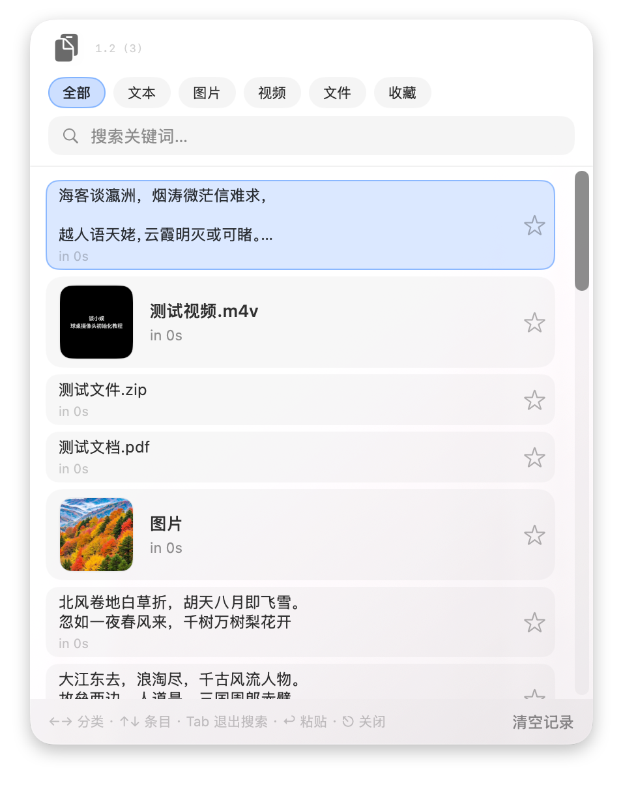

# ClipStack

macOS 剪切板/剪贴板工具：记录最近复制的内容（文本、图片、文件等），通过快捷键呼出浮窗，按分类浏览、搜索、收藏，并一键粘贴回当前应用。

## 功能概览

- **剪贴板监控**：自动记录最近条目（默认最多 80 条），支持文本、图片、视频文件、其他文件等分类
- **浮窗**：快捷键唤出（默认 **⌥ 空格**，可在菜单「设置」中调整相关行为）
- **分类与搜索**：全部 / 文本 / 图片 / 视频 / 文件 / 收藏；支持关键词筛选；打开浮窗会重置搜索；搜索框聚焦时 **Tab** 可退出搜索框，恢复 ←→ 切换分类
- **收藏**：可固定常用条目（持久化到本机）
- **粘贴**：选中条目后回车，会尝试将内容写回系统剪贴板并模拟粘贴（需 **辅助功能** 权限以稳定粘贴）

## 系统要求

- **macOS 13 Ventura** 或更高版本（SwiftUI `MenuBarExtra` 依赖）
- Apple Silicon 或 Intel（需自行用对应架构或通用二进制构建；默认在 Apple Silicon 上构建为 `arm64`）

## 安装

1. 打开 `.dmg`，将 **ClipStack** 拖入 **应用程序**
2. 首次若出现 **「已损坏，无法打开」** 或 Gatekeeper 拦截（未使用 Apple Developer ID + 公证时较常见）：
   - 在终端执行：  
     `xattr -cr "/Applications/ClipStack.app"`
   - 再在 **应用程序** 中对 **ClipStack** **右键 → 打开 → 仍要打开**  
   - 或在 **系统设置 → 隐私与安全性** 中按提示允许
3. 在 **隐私与安全性 → 辅助功能** 中为 ClipStack 授权，以便粘贴快捷键生效

> **异常提示原因**:由于未进行苹果官方有效开发者签名 + 公证,所以只能另辟蹊径

## 常见问题

### 选定条目后只是写到剪贴板、没有自动粘贴

绝大多数情况是「**辅助功能权限失效**」：
- 重建 / 升级 / 重新 ad-hoc 签名后，macOS 会让原来给 ClipStack 的「辅助功能」授权失效（即使开关看起来还在「打开」）。没有这个权限，`CGEvent` 发出去的合成 ⌘V 会被系统直接丢弃。
- 修复方法：**系统设置 → 隐私与安全性 → 辅助功能**，把 ClipStack 先「移除」（点 `−`）再重新「添加」（点 `+` 选回新的 `.app`），打开开关后**完整退出再重启** ClipStack（菜单栏 → 退出，然后重新 `open .app`）。TCC 权限是进程启动时读取的，运行中切换不会立刻生效。
- 排查：诊断日志在 `~/Library/Logs/ClipStack/runtime.log`，启动时会写一行 `[BOOT] ... trusted=true/false ...`；如果是 `false`，就是上面的权限问题。

### 浮窗里点了一下没反应

单击只会**选中高亮**。要触发粘贴：**按回车 Enter** 或**双击**条目。

如有问题可在 Issues 中反馈
